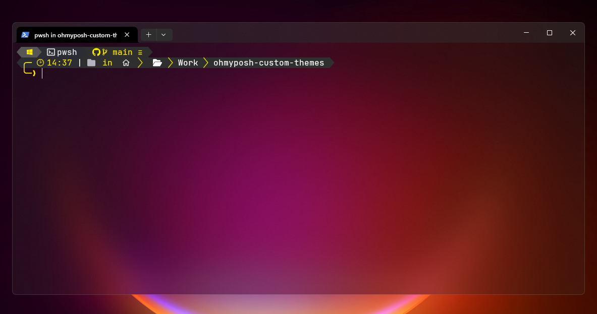
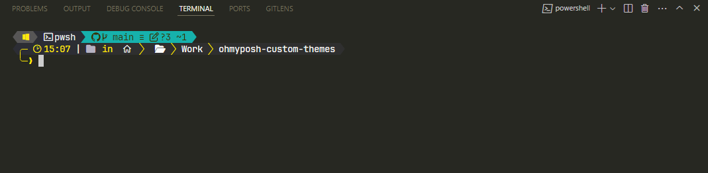

# My "oh-my-posh" Custom Theme : EnergY

## Preview

This is a preview of my Windows Terminal with my custom Oh-My-Posh theme

<p align="center">

</p>

It can also be integrated with vs code terminal too !!

<p align="center">

</p>

## Windows Powershell : Installation and setup

### Nerd Font

- Download the zip of any nerd font that you like from the github release page, extract it and install it to you machine  : 

    - https://github.com/ryanoasis/nerd-fonts/releases

> Personally, I use both JetBrainsMono font and the Hack font 

### oh-my-posh CLI


- Install the official [Windows Terminal][windowsterminal] from microsoft store (for best experience)

- Open the terminal and install `oh-my-posh.exe` and `themes` via Via [WinGet][winget]

```powershell
winget install JanDeDobbeleer.OhMyPosh -s winget
```

- Check if oh-my-posh is working by chosing the default theme

```powershell
oh-my-posh init pwsh --config "$env:POSH_THEMES_PATH\jandedobbeleer.omp.json" | Invoke-Expression
```


### Profile setup up

Add a profile, so that everytime you launch the terminal, the theme should be loaded and ready.

- Add my custom theme `energy.omp.json` to the oh-my-posh theme directory, you can get the oh-my-posh theme direcotry path by running : 

```powershell
Get-ChildItem ENV:POSH_THEMES_PATH

Name                           Value
----                           -----
POSH_THEMES_PATH               C:\...\oh-my-posh\themes
```

- Set PowerShell to only require remote scripts to be signed : 

```powershell
New-Item -Path $PROFILE -Type File -Force
```

- Edit your PowerShell profile script using notepad :

```powershell
notepad $PROFILE
```

- Add the following line to your notepad : 

```powershell
oh-my-posh init pwsh --config '$env:POSH_THEMES_PATH\energy.omp.json' | Invoke-Expression
```

- Restart you terminal, if this doesn't work, try adding an exception to your Antivirus as stated by the oh-my-posh documentation :

```powershell
& ([ScriptBlock]::Create((oh-my-posh init pwsh --config "$env:POSH_THEMES_PATH\energy.omp.json" --print) -join "`n"))
```

- Now your Windows terminal should look new and clean !

<br/>

> For more details, refer to the oh-my-posh doc Windows installation  : https://ohmyposh.dev/docs/installation/windows


### By [Hamza-CHICHI][Hamza-CHICHI]
 


[windowsterminal]: https://github.com/microsoft/terminal
[winget]: https://github.com/microsoft/winget-cli
[Hamza-CHICHI]: https://github.com/Hamza-CHICHI